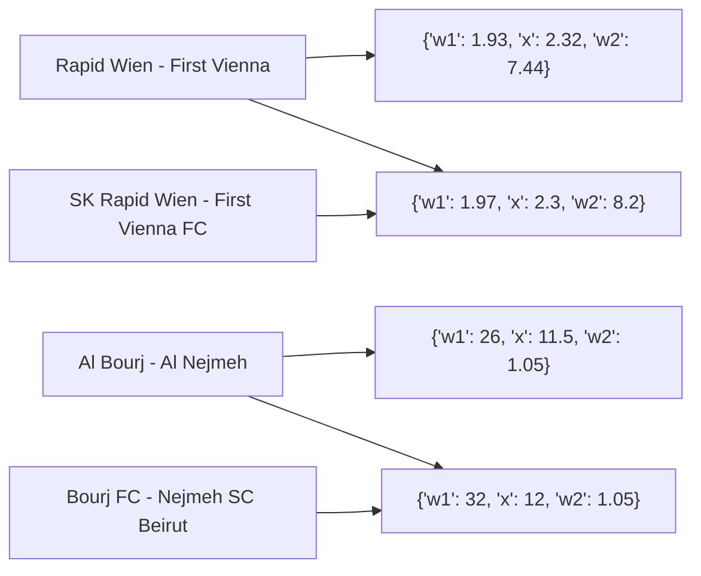

# Fuzzy Map 

[](https://pypi.org/project/fuzzymap/)
[](https://github.com/pysnippet/fuzzymap/blob/master/LICENSE)
[](https://app.fossa.com/projects/git%2Bgithub.com%2Fpysnippet%2Ffuzzymap?ref=badge_shield)
[](https://github.com/pysnippet/fuzzymap/actions/workflows/tests.yml)

The Fuzzy Map is a polymorph Python dictionary that always returns the value of the closest similar key. This kind of
dictionary returns the value of the exact key if there is such a key. Otherwise, it will return the value of the most
similar key satisfying the given ratio. The exact mechanism works when setting a new or replacing an old key in the
dictionary. If the key is not found and does not match any of the keys by the given ratio, it returns none.

## A real-world example

A live data parser collects the coefficients of sports games from different bookmakers at once, and then an analyzer
tries to find the existing forks. Different bookmakers use different names for the same games. Some of them use the full
names, and others use names with a partial abbreviation that makes the analyzer's job harder to find and compare the
coefficients of the same game. Rather this could be hard without `FuzzyMap` that can find the game using the name used
in one of the sources.

```python
from fuzzymap import FuzzyMap

source_1 = {
    'Rapid Wien - First Vienna': {'w1': 1.93, 'x': 2.32, 'w2': 7.44},
    'Al Bourj - Al Nejmeh': {'w1': 26, 'x': 11.5, 'w2': 1.05},
    # hundreds of other games' data
}

source_2 = FuzzyMap({
    'Bourj FC - Nejmeh SC Beirut': {'w1': 32, 'x': 12, 'w2': 1.05},
    'SK Rapid Wien - First Vienna FC': {'w1': 1.97, 'x': 2.3, 'w2': 8.2},
    # hundreds of other games' data
})

for game, odds1 in source_1.items():
    odds2 = source_2[game]

    # odds1 = {"w1": 1.93, "x": 2.32, "w2": 7.44}
    # odds2 = {"w1": 1.97, "x": 2.3, "w2": 8.2}
    handle_fork(odds1, odds2)
```

In this code example, `source_1` and `source_2` are the dictionary of game and coefficients key-value pairs parsed from
different sources. And converting the `source_2` dictionary to the `FuzzyMap` dictionary makes it able to find the
corresponding game using the game's key used in the `source_1` dictionary.



## License

Copyright (C) 2022 Artyom Vancyan. [GPLv2](https://github.com/pysnippet/fuzzymap/blob/master/LICENSE)
