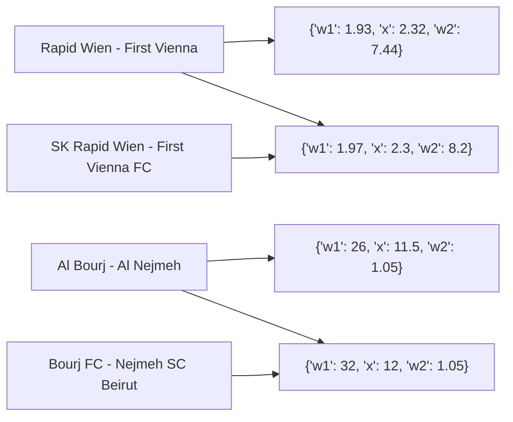

# FuzzyMap 

[](https://pypi.org/project/fuzzymap/)
[](https://github.com/pysnippet/fuzzymap/blob/master/LICENSE)
[](https://app.fossa.com/projects/git%2Bgithub.com%2Fpysnippet%2Ffuzzymap?ref=badge_shield)

## What is FuzzyMap?

`FuzzyMap` is a polymorph Python dictionary. This kind of dictionary returns the value of the exact key if there is such
a key. Otherwise, it will return the value of the most similar key satisfying the given ratio. The same mechanism works
when setting a new or replacing an old key in the dictionary. If the key is not found and does not match any of the keys
by the given ratio, it returns `None`.

## How does it work?

Suppose you have scraped data from multiple sources that do not have a unique identifier, and you want to compare the
values of the items having the same identifiers. Sure there will be found a field that mostly has an equivalent value
at each source. And you can use that field to identify the corresponding items of other sources' data.

## Let's look at the following example

There is a live data parser that collects the coefficients of football matches from different bookmakers at once, then
calculates and logs the existing forks. Many bookmakers change the name of the teams to be incomparable with names on
other sites.

```python
from fuzzymap import FuzzyMap

src1 = {
    'Rapid Wien - First Vienna': {'w1': 1.93, 'x': 2.32, 'w2': 7.44},
    'Al Bourj - Al Nejmeh': {'w1': 26, 'x': 11.5, 'w2': 1.05},
    # hundreds of other teams' data
}

src2 = FuzzyMap({
    'Bourj FC - Nejmeh SC Beirut': {'w1': 32, 'x': 12, 'w2': 1.05},
    'SK Rapid Wien - First Vienna FC': {'w1': 1.97, 'x': 2.3, 'w2': 8.2},
    # hundreds of other teams' data
})

for team, coefs1 in src1.items():
    coefs2 = src2[team]

    # coefs1 = {"w1": 1.93, "x": 2.32, "w2": 7.44}
    # coefs2 = {"w1": 1.97, "x": 2.3, "w2": 8.2}
    handle_fork(coefs1, coefs2)
```

With a human brain, it is not difficult to identify that "Rapid Wien - First Vienna" and "SK Rapid Wien - First Vienna
FC" matches are the same. In the above example, the `src2` is defined as `FuzzyMap`, it makes its keys fuzzy-matchable,
and we can get an item corresponding to the key of `src1`. See the below graph demonstrating the associations of
`FuzzyMap` keys.



## License

Copyright (C) 2022 Artyom Vancyan. [GPLv2](https://github.com/pysnippet/fuzzymap/blob/master/LICENSE)
